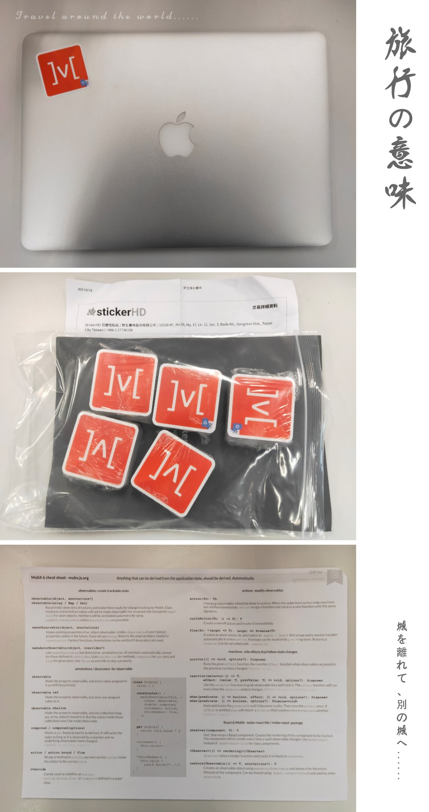

# MobX

_简单，可扩展的状态管理库_

---

### 中文文档翻译计划

mobx是一个流行的状态管理库，在全世界有很多用户。mobx中文文档目前停滞在mobx5版本,可以访问[cn.mobx.js.org](https://cn.mobx.js.org)查看，内容落后当前v6版本很多。因此[@iChenLei](https://github.com/ichenlei)和[@mweststrate](https://github.com/mweststrate)、[@FredyC](https://github.com/FredyC)发起了mobx6中文文档项目，欢迎mobx中文用户参与翻译工作。

### 翻译贡献者

> Mobxjs Team衷心感谢以下参与文档翻译的同学(排名不分先后

<table>
  <tr>
    <td align="center"><a href="https://github.com/WanderWang"> <b>WanderWang</b></a> <a href="https://github.com/mobxjs/zh.mobx.js.org/commits?author=WanderWang" title="PR">💻</a></td>
    <td align="center"><a href="https://github.com/mobxjs/zh.mobx.js.org/"> <b>next contributor</b></a> <a href="https://github.com/mobxjs/zh.mobx.js.org/pulls" title="PR">💻</a></td>
    <td align="center"><a href="https://github.com/mobxjs/zh.mobx.js.org/"> <b>next contributor</b></a> <a href="https://github.com/mobxjs/zh.mobx.js.org/pulls" title="PR">💻</a></td>
    <td align="center"><a href="https://github.com/mobxjs/zh.mobx.js.org/"> <b>next contributor</b></a> <a href="https://github.com/mobxjs/zh.mobx.js.org/pulls" title="PR">💻</a></td>
  </tr>
</table>

### 如何参与翻译？
> 开始翻译前，请确认当前文档无人认领翻译，避免重复劳动
> 不需要您clone本项目到本地，我们极力推荐所有工作都在Github网页完成。

方式1：查看本项目docs文件夹，找到感兴趣的文档.md文件，在Github页面使用`edit this file`功能开始翻译

方式2：打开文档网站`https://zh.mobx.js.org`,找到感兴趣的未翻译的文档点击右上角`我来翻译or纠错 ↗️`参与翻译

提交翻译PR之后，Github Actions会自动部署预览文档(支持`netlify`和`vercel`)，您可以打开预览链接查看文档是否有错别字或者样式上的问题，确认无问题即可@iChenLei开始校对，PR合进main主分支之后您翻译的内容就会写入最终的官方中文文档也就是`zh.mobx.js.org`，文档最终部署在`vercel`平台(`vercel`是我们的赞助商

注：不用担心自己的翻译水平差，这里love & peace，欢迎任何同学参与翻译工作，提出您的意见

### 翻译规范
目前工作重心会先放在完成翻译上，我们会在翻译过程中积累沉淀规范以提高质量，目前暂不提前设定规范来约束翻译活动进展。

### 翻译奖励
对于提过PR并成功合并的同学，我们会将您的账号放在本项目仓库的README.md中的贡献者名单里(如上所示)。对于贡献较大的同学我们我们会奖励Mobx官方贴纸和Mobx6 Cheatsheet，并将您的Github账号放在文档网站首页。（一般来说贡献较大是指翻译一篇或者多篇文档，积极参与校对也属于贡献较大

>Mobx6 Cheatsheet为电子版PDF，通过Email发送。考虑邮递成本，Mobx贴纸将以中国邮政平信的方式寄到您的地址。

### 感谢赞助商Vercel

### License
MIT @ Mobxjs Team